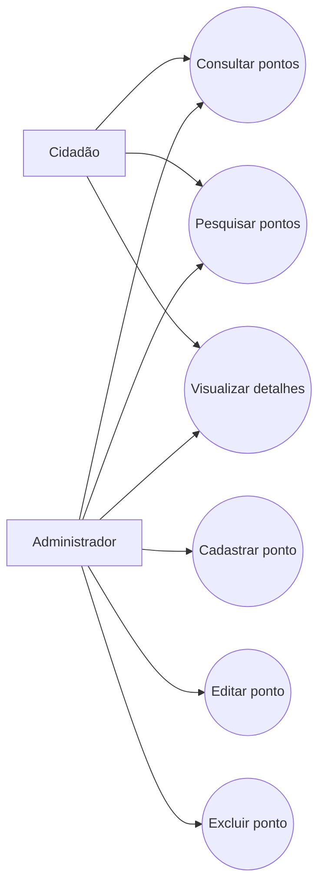

# EcoPonto BH

## Descrição
O **EcoPonto BH** é uma aplicação web desenvolvida para facilitar a busca e o cadastro de pontos de coleta seletiva e descarte adequado de resíduos. A proposta do sistema é ajudar cidadãos a encontrarem locais apropriados para descartar materiais como papel, plástico, vidro, metal, eletrônicos, pilhas e baterias, contribuindo para práticas mais sustentáveis no contexto urbano.

## Objetivo
Desenvolver uma solução de software que auxilie a população no acesso a informações sobre pontos de coleta, promovendo o descarte correto de resíduos e incentivando ações relacionadas à sustentabilidade.

## Problema
Muitas pessoas não sabem onde descartar corretamente determinados resíduos, especialmente materiais recicláveis e resíduos especiais, como eletrônicos e pilhas. A falta de centralização dessas informações dificulta a adoção de práticas sustentáveis e contribui para o descarte inadequado.

## ODS relacionada
Este projeto está relacionado ao **Objetivo de Desenvolvimento Sustentável 12 - Consumo e Produção Responsáveis**, com foco em incentivar o descarte adequado e ampliar o acesso à informação ambiental.

## Tipo de solução
A solução proposta é um **sistema web com frontend e backend**, permitindo que usuários consultem pontos de coleta e que a aplicação mantenha os dados organizados em uma base estruturada.

## Justificativa da solução
A escolha por um sistema web se deve à facilidade de acesso por navegador, à praticidade de uso em diferentes dispositivos e à possibilidade de integrar funcionalidades como cadastro, busca, filtragem e gerenciamento de pontos de coleta em uma única aplicação.

## Funcionalidades esperadas
- Consultar pontos de coleta cadastrados
- Pesquisar pontos de coleta por bairro, tipo de resíduo ou nome
- Visualizar informações de cada ponto de coleta
- Cadastrar novos pontos de coleta
- Editar informações de pontos cadastrados
- Remover pontos de coleta

## Requisitos funcionais
- RF01: O sistema deve permitir o cadastro de pontos de coleta.
- RF02: O sistema deve permitir a listagem dos pontos de coleta cadastrados.
- RF03: O sistema deve permitir a busca de pontos de coleta por critérios como bairro, nome ou tipo de resíduo.
- RF04: O sistema deve permitir a visualização dos detalhes de um ponto de coleta.
- RF05: O sistema deve permitir a edição de pontos de coleta.
- RF06: O sistema deve permitir a exclusão de pontos de coleta.

## Requisitos não funcionais
- RNF01: O sistema deve possuir interface simples e intuitiva.
- RNF02: O sistema deve ser acessível por navegadores modernos.
- RNF03: O sistema deve apresentar tempo de resposta adequado para operações de consulta.
- RNF04: O sistema deve manter os dados organizados em uma base persistente.
- RNF05: O código-fonte e a documentação devem ser mantidos em repositório público no GitHub.
- RNF06: A documentação do projeto deve ser escrita em Markdown.

## Caso de uso

## Tecnologias previstas
As tecnologias serão definidas ao longo do desenvolvimento, mas a proposta inicial considera:
- Frontend web
- Backend com API
- Banco de dados para persistência das informações
- GitHub para versionamento e documentação
