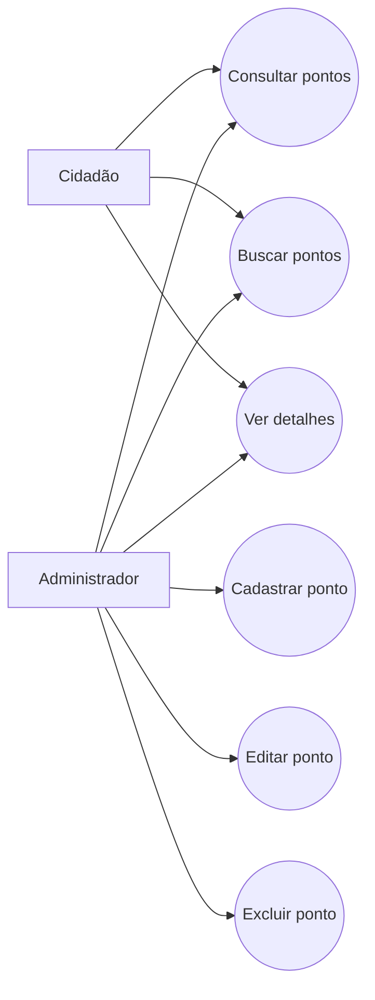

# EcoPonto BH (TP1)

## Contexto rápido
Projeto simples da disciplina para praticar Engenharia de Software com foco em ODS.
A ideia é resolver um problema real sem complicar demais.

## O que esta entrega (TP1) precisa ter
Nesta entrega, cada aluno(a) deverá realizar a análise inicial do projeto que será desenvolvido. Para tanto, espera-se que sejam definidos:
1. o objetivo que será abordado no trabalho;
2. o problema que será resolvido pela solução de software planejada;
3. o tipo de solução que será desenvolvido;
4. os requisitos funcionais e não funcionais da aplicação;
5. o diagrama de caso de uso da aplicação.

---

## 1) Objetivo
Ajudar pessoas a descartarem resíduos corretamente, encontrando pontos de coleta em Belo Horizonte.

## 2) Problema
Muita gente não sabe onde descartar recicláveis e resíduos especiais (pilhas, baterias, eletrônicos etc.).
Sem informação centralizada, o descarte acaba sendo feito de forma errada.

## 3) Tipo de solução
Sistema web com frontend + backend (não é página estática).

## 4) Requisitos
### Funcionais (RF)
- RF01: Cadastrar ponto de coleta.
- RF02: Listar pontos de coleta.
- RF03: Buscar por bairro, nome ou tipo de resíduo.
- RF04: Ver detalhes de um ponto.
- RF05: Editar ponto.
- RF06: Excluir ponto.

### Não funcionais (RNF)
- RNF01: Interface simples e direta.
- RNF02: Funcionar em navegadores modernos.
- RNF03: Consultas com resposta rápida (meta: até 2s em cenário normal).
- RNF04: Dados persistidos em banco.
- RNF05: Projeto público no GitHub.
- RNF06: Documentação em Markdown.

## 5) Diagrama de caso de uso

---

## Sobre as issues (GitHub Projects)
O planejamento do trabalho deve ser realizado utilizando GitHub Projects.
Os requisitos funcionais devem ser lançados no projeto do repositório, na coluna **Project Backlog**.
Na coluna **TODO**, devem ficar as atividades do sprint seguinte.

Exemplo prático para agora (entrega TP1):
- **Project Backlog:** RF01, RF02, RF03, RF04, RF05, RF06.
- **TODO (TP2):** definir stack, modelar arquitetura C4, documentar decisões arquiteturais.

## Estrutura mínima do repositório
Não existe template obrigatório, mas a estrutura conta na avaliação.
Para TP1, estrutura simples:
- `README.md` (fonte única de informação)
- `.github/ISSUE_TEMPLATE/` (templates de issue para popular o Projects)
