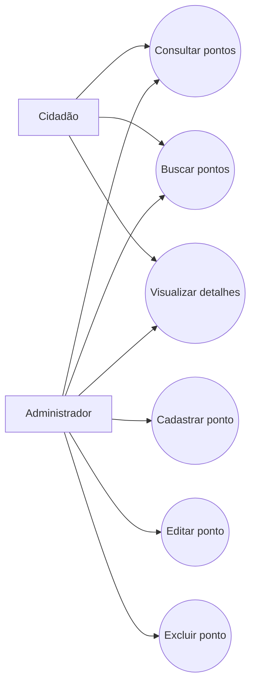

# Casos de Uso (TP1)

## Atores
- **Cidadão**
- **Administrador**

## Diagrama de caso de uso (Mermaid)

## Relação com requisitos
- UC1 e UC2 atendem RF02 e RF03.
- UC3 atende RF04.
- UC4 atende RF01.
- UC5 atende RF05.
- UC6 atende RF06.
